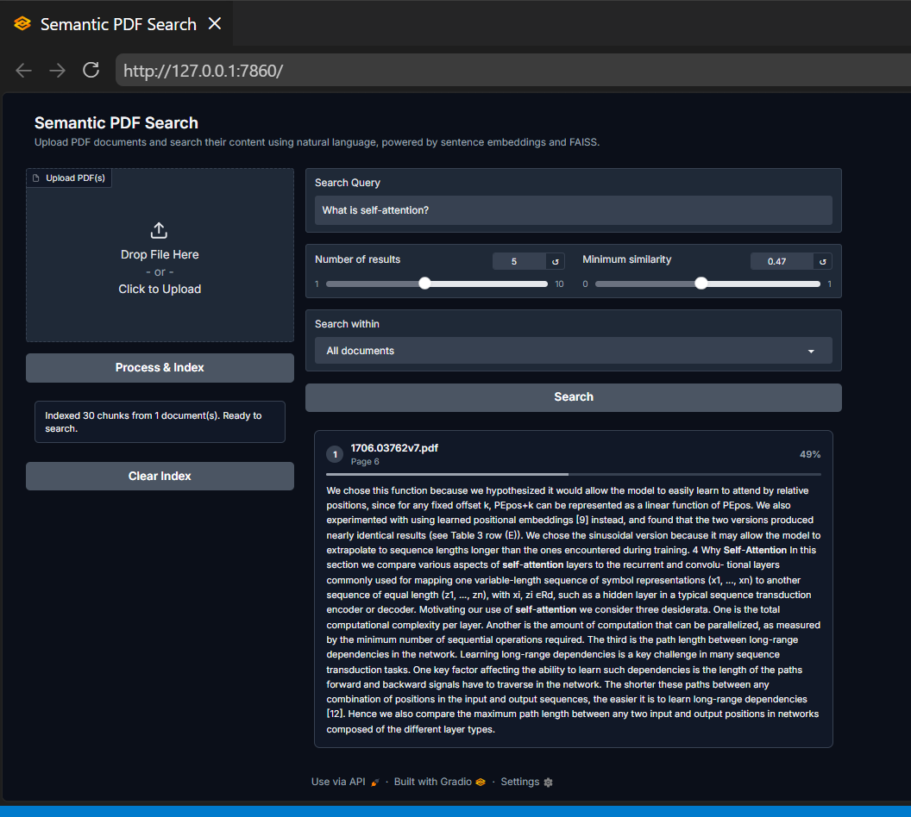

# Semantic PDF Search


## Semantic Document Search using Semantic Embeddings


Local RAG system for semantic search over PDF documents. Upload a PDF, ask a question in plain language, get the most relevant sections back ranked by meaning, not keywords.
checkout using pdf serach: [https://huggingface.co/spaces/KD0009/SemanticPDFReader](https://huggingface.co/spaces/KD0009/SemanticPDFReader)


### Features

- PDF upload and text extraction
- Sentence-aware chunking
- Embeddings via `sentence-transformers` (`all-MiniLM-L6-v2`)
- Vector search via FAISS (HNSW index)
- Similarity threshold and per-document filtering
- File-hash caching (skip re-embedding unchanged PDFs)
- Gradio UI

### Preview



### Run locally

```bash
python -m venv venv
source venv/bin/activate      # Windows: venv\Scripts\activate
pip install -r requirements.txt
python app.py
```

Opens at `http://localhost:7860`.

### Stack

| Component | Tool |
|---|---|
| Embeddings | sentence-transformers |
| Vector search | FAISS |
| PDF parsing | PyMuPDF |
| UI | Gradio |

### Deployment on Hugging face

- Create Space: huggingface.co/new-space → SDK: Gradio
- Clone repo locally: ```git clone https://huggingface.co/spaces/<user>/<space-name>```
- Copy app.py, requirements.txt into it
- ```git add . && git commit -m "init" && git push```
- Space auto-builds, gives you a live URL

### Perform

1. Docs you can use:
   
For richer multi-page text (better for semantic search testing): arxiv paper PDF, e.g. https://arxiv.org/pdf/1706.03762 (the "Attention Is All You Need" paper). For a quick trivialtest: https://www.orimi.com/pdf-test.pdf (single page).

2. Querries to ask:

What is self-attention?
How does multi-head attention work?
Why avoid recurrence in sequence models?
What is positional encoding?
How is the Transformer trained?
BLEU Score?
